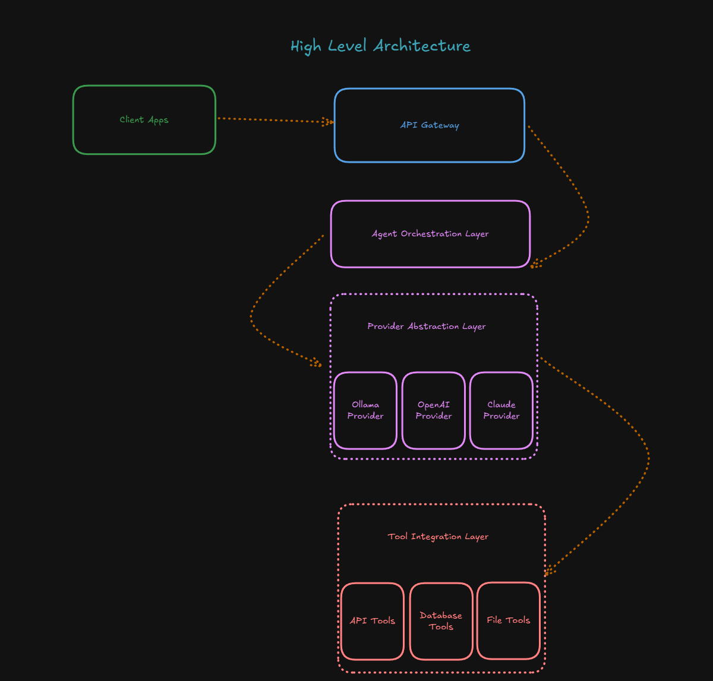

# AI Agent Service

A modern, intelligent AI Agent Service framework built with FastAPI & FastMCP that demonstrates how to implement agent tool management, prompt handling, and multi-provider AI integration from scratch. This project showcases a production-ready implementation of agent-specific tool filtering, dynamic system prompts, and unified provider interfaces without relying on abstraction frameworks. Built with Docker, comprehensive logging, and enterprise-grade features. The service now includes comprehensive streaming support across all providers and API endpoints, enabling real-time response delivery and enhanced user experience.

## ✨ Features

### 🏗️ **Core Framework**
* **Framework Design** - Complete implementation showing how to build AI agents from the ground up
* **FastAPI Framework** - Modern, fast web framework with automatic API documentation
* **AI Agent Capabilities** - Intelligent automation and decision-making
* **Health Check Endpoints** - Built-in monitoring and status endpoints

### 🔌 **AI Integration & Providers**
* **Multi-Provider AI Support** - Azure OpenAI, Ollama with unified interface
* **MCP Integration** - Model Context Protocol for external tools using fastmcp library
* **OpenAI-Compatible API** - Full OpenAI protocol compliance with streaming support
* **Streaming Support** - Real-time response streaming across all providers and API endpoints

### 🛠️ **Tool & Resource Management**
* **Tool Filtering** - Agent-specific permissions and authorization
* **Prompt Management** - Dynamic system prompts with tool integration
* **Agent Resource Manager** - Per-agent resource access control and automatic resource creation
* **Resource Management** - Global resource lifecycle management with agent-specific filtering

### ⚙️ **Configuration & Development**
* **Model Configuration** - Flexible model selection and parameter management
* **CLI Parameter Overrides** - Runtime model and setting customization
* **Environment Configuration** - Flexible settings with environment variable support
* **Hot Reload** - Development mode with automatic code reloading

### 🧠 **Memory & Persistence**
* **Memory Persistence** - PostgreSQL-based conversation history with automatic cleanup
* **Memory Compression** - Intelligent conversation history management with AI-powered summarization
* **Response Processing** - Automatic response cleaning and formatting for memory storage

### 🧪 **Testing & Evaluation**
* **Agent Performance Assessment** - DeepEval integration for comprehensive evaluation
* **Synthetic Test Generation** - Create golden datasets for consistent testing
* **Metric-Based Evaluation** - Tool correctness, hallucination detection, answer relevancy

### 🚀 **Production & Quality**
* **Docker Support** - Multi-stage builds with development and production targets
* **Structured Logging** - Comprehensive logging setup for debugging and monitoring
* **Type Safety** - Full type hints throughout the codebase
* **Auto-Generated Docs** - Interactive API documentation with Swagger UI and ReDoc

## 🚀 Quick Start

### Using Docker (Recommended)

```bash
# Clone the repository
git clone https://github.com/ScottRBK/ai-agent-service
cd ai-agent-service

# Run in development mode
cd docker
docker-compose --profile dev up --build
```

The service will be available at:
- **API**: http://localhost:8001
- **Health Check**: http://localhost:8001/health
- **API Docs**: http://localhost:8001/docs
- **ReDoc**: http://localhost:8001/redoc

### Local Development

```bash
# Create virtual environment
python -m venv .venv
source .venv/bin/activate  # On Windows: .venv\Scripts\activate

# Install dependencies
pip install -r requirements.txt

# Run the application
python -m app.main
```

## Software Architecture


## 📁 Project Structure 

```
ai-agent-service/
├── app/
│   ├── api/
│   │   └── routes/
│   │       ├── __init__.py
│   │       ├── health.py              # Health check endpoints
│   │       ├── agents.py              # Agent management API
│   │       └── openai_compatible.py   # OpenAI-compatible API with streaming
│   ├── core/
│   │   ├── agents/
│   │   │   ├── base_agent.py            # Base agent class with common functionality
│   │   │   ├── agent_tool_manager.py    # Agent tool filtering with fastmcp
│   │   │   ├── agent_resource_manager.py # Agent resource management
│   │   │   ├── prompt_manager.py        # System prompt management
│   │   │   ├── cli_agent.py             # CLI agent implementation (inherits from BaseAgent)
│   │   │   ├── api_agent.py             # API agent implementation with streaming (inherits from BaseAgent)
│   │   │   └── memory_compression_agent.py # Memory compression agent (inherits from BaseAgent)
│   │   ├── providers/
│   │   │   ├── base.py                  # Base provider interface
│   │   │   ├── azureopenapi.py          # Azure OpenAI (Responses API) with streaming
│   │   │   ├── azureopenapi_cc.py       # Azure OpenAI (Chat Completions) with streaming
│   │   │   └── ollama.py                # Ollama provider with streaming
│   │   ├── resources/
│   │   │   ├── base.py                  # Base resource interface
│   │   │   ├── manager.py               # Global resource management
│   │   │   ├── memory.py                # PostgreSQL memory resource
│   │   │   └── memory_compression_manager.py # Memory compression logic
│   │   └── tools/
│   │       ├── tool_registry.py         # Tool management
│   │       └── function_calls/          # Built-in tools
│   ├── config/
│   │   └── settings.py                  # Application configuration
│   ├── models/
│   │   ├── agents.py                    # Agent API models
│   │   └── resources/
│   │       └── memory.py                # Memory data models
│   └── utils/
│       ├── logging.py                   # Logging configuration
│       └── chat_utils.py                # Response cleaning utilities
├── tests/
│   ├── test_core/
│   │   ├── test_agents/                 # Agent unit tests
│   │   ├── test_providers/              # Provider tests with streaming
│   │   ├── test_resources/              # Resource tests
│   │   └── test_tools/                  # Tool tests
│   ├── test_api/
│   │   ├── test_agents.py               # Agent API tests
│   │   └── test_openai_compatible_integration.py # OpenAI API tests with streaming
│   └── test_integration/                # End-to-end tests
├── app/
│   ├── evaluation/
│   │   ├── config.py                    # Evaluation configuration models
│   │   ├── runner.py                    # Evaluation execution engine
│   │   ├── dataset.py                   # Golden dataset management
│   │   ├── evaluation_utils.py          # Result analysis utilities
│   │   └── evals/                       # Agent-specific evaluations
│   │       └── cli_agent.py             # CLI agent evaluation example
├── examples/
│   └── run_agent.py                     # CLI agent runner
├── docker/
│   ├── Dockerfile                       # Multi-stage Docker build
│   └── docker-compose.yml               # Development environment
├── agent_config.json                    # Agent configurations
├── prompts/                             # System Prompt Files per agent
├── mcp.json                             # MCP server config
└── requirements.txt
```

## 🔧 Configuration

The service uses environment-based configuration with sensible defaults. Key configuration areas include:

- **Environment Variables**: Service settings, ports, logging levels
- **Agent Configuration**: Tool permissions, model settings, resources  
- **MCP Server Authorization**: Secure token management with `${VARIABLE_NAME}` substitution
- **Docker Volume Mounts**: Flexible configuration file management

For detailed configuration options, environment variables, and examples, see [Deployment Guide](docs/deployment.md).

## 📡 API Reference

The service provides comprehensive REST and OpenAI-compatible APIs:

- **Agent Management**: Create, configure, and interact with AI agents
- **OpenAI Compatibility**: Standard `/v1/chat/completions` and `/v1/models` endpoints
- **Memory Management**: Conversation history and session management
- **Streaming Support**: Real-time response streaming across all endpoints

For detailed API documentation with examples, see [API Reference](docs/api-reference.md).

## 🐳 Deployment

### Quick Start
```bash
# Development mode
cd docker
docker-compose --profile dev up --build
```

### Production Deployment
```bash
# Production build
docker build -f docker/Dockerfile --target production -t ai-agent-service:latest .
docker run -p 8000:8000 ai-agent-service:latest
```

For comprehensive deployment instructions, environment configuration, and production setup, see [Deployment Guide](docs/deployment.md).

## 🤖 Agent System

The service provides a comprehensive agent framework with:

- **Multi-Provider Support**: Azure OpenAI, Ollama with unified interface  
- **Agent-Specific Tool Filtering**: Granular control over tool access per agent
- **MCP Integration**: HTTP and command-based Model Context Protocol servers
- **Memory Management**: PostgreSQL-based conversation persistence with compression
- **Dynamic Configuration**: Runtime model and parameter overrides

For detailed agent configuration, MCP server setup, and provider information, see [Usage Examples](docs/examples.md).

## 🤖 Running Agents

### Quick Start
```bash
# Run research agent with web search capabilities
python examples/run_agent.py research_agent azure_openai_cc

# Run CLI agent with full tool access and memory
python examples/run_agent.py cli_agent azure_openai_cc

# Override model and settings
python examples/run_agent.py cli_agent ollama --model qwen3:4b --setting temperature 0.7
```

### Available Agents
- **research_agent**: Web research with search tools
- **cli_agent**: Interactive CLI with full tool access  
- **api_agent**: Optimized for web API usage
- **mcp_agent**: MCP tools only

For comprehensive usage examples, agent configurations, and detailed CLI options, see [Usage Examples](docs/examples.md).


For troubleshooting common issues, configuration problems, and deployment guidance, see [Deployment Guide](docs/deployment.md).

## 🧪 Testing & Evaluation

### Testing Coverage
- **285+ comprehensive tests** covering all core functionality
- **Unit Testing**: Agent architecture, tool filtering, memory management
- **Integration Testing**: End-to-end workflows, MCP servers, streaming
- **Performance Testing**: Memory compression, response times

### Evaluation Framework  
- **DeepEval Integration**: Agent performance assessment
- **Tool Correctness**: Validates appropriate tool usage
- **Hallucination Detection**: Factual accuracy measurement
- **Custom Metrics**: GEval with observability and tracing

### Run Agent Evaluations
```bash
# Generate golden test cases
python app/evaluation/evals/cli_agent.py --generate

# Run evaluation with detailed output
python app/evaluation/evals/cli_agent.py --verbose
```

### Quick Test Commands
```bash
# Run all tests
pytest tests/

# Run with coverage
pytest tests/ --cov=app --cov-report=html
```

For detailed testing examples and evaluation framework documentation, see [Evaluation Framework](docs/evaluation.md).


## 🛠️ Development

The service uses a modular architecture with clean separation of concerns:

- **BaseAgent Architecture**: Unified agent foundation with inheritance
- **Provider Abstraction**: Support for multiple AI providers  
- **Tool System**: Plugin-based MCP and function tools
- **Hot Reload**: Development mode with automatic code reloading

For detailed development patterns, custom agent creation, and code examples, see [Usage Examples](docs/examples.md).

## 📦 Key Dependencies

- **FastAPI** - Modern async web framework with automatic API documentation
- **FastMCP** - Model Context Protocol integration with HTTP and command support
- **PostgreSQL** - Conversation memory persistence and management
- **DeepEval** - AI agent evaluation and performance assessment

## 🤝 Contributing

1. Fork the repository
2. Create a feature branch (`git checkout -b feature/amazing-feature`)
3. Commit your changes (`git commit -m 'Add amazing feature'`)
4. Push to the branch (`git push origin feature/amazing-feature`)
5. Open a Pull Request

## 📝 License

This project is licensed under the MIT License - see the LICENSE file for details.

## 🆘 Support

For questions or issues:
1. Check the [API documentation](http://localhost:8001/docs) when running locally
2. Review the logs: `docker logs <container-name>`
3. Open an issue in this repository

---

**Happy coding!** 🚀